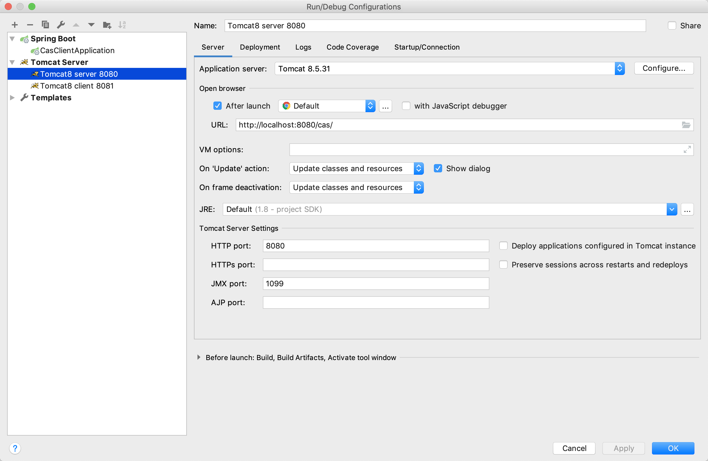
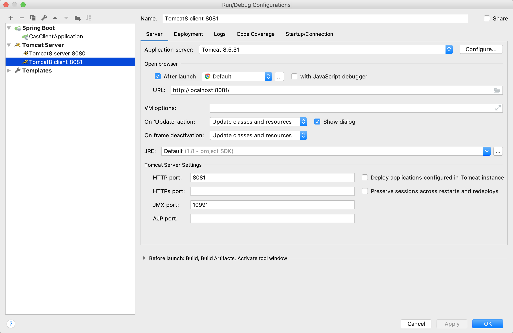

# CAS 5.3.x 服务端+客户端示例

#### 介绍

​	本示例包含以下模块：

|项目名|功能说明|访问路径|
|-----|----|----|
|cas-server|cas服务端|http://localhost:8080/cas|
|cas-client-springboot|cas客户端(springboot项目)|http://localhost:8081/|
|cas-client-webapp|cas客户端(传统web项目)|http://localhost:8082/|


#### 软件架构
​	本套cas架构基于`cas5.3.x`。为了方便开发测试，本示例没有使用https协议，所有的服务都是使用http协议。


#### 使用说明

下面以IDEA中启动为例进行说明。

1. 准备数据。找一个mysql数据库，将项目中的sql文件导入，便有了一个admin用户。

2. 修改数据库连接配置。配置文件在：`./cas-server/src/main/resources/application.properties`

3. 添加tomcat服务器，修改端口号（HTTP:8080 JMX:1099），添加服务端项目(cas-server)，配置项目路径为`/cas`。

   

4. 再添加一个tomcat服务器，修改端口号(HTTP:8081 JMX:10991)，添加客户端项目(cas-client-webapp)，配置项目路径为`/`

   

5. 启动cas-server

6. 启动cas-client-webapp

7. 启动cas-client-springboot项目

8. 打开浏览器，访问客户端1`http://localhost:8081/`，发现可以跳转到cas认证服务的界面，输入用户名密码`admin/111111`登录成功后再访问客户端2，也是登录成功状态。在任意一个客户端退出登录，另一个客户端也会自动退出。

#### 关于客户端升级

1. 为何要升级

   因为服务端升级。以前的cas服务端基于`cas3.5.x`，使用的是`cas2.0协议`，现在基于`cas5.3.x`，使用的是`cas3.0协议`。

2. 如何升级 

   只需修改web.xml文件中相关配置。

   将负责CAS校验的过滤器由

```
org.jasig.cas.client.validation.Cas20ProxyReceivingTicketValidationFilter
```
​		改为
```
org.jasig.cas.client.validation.Cas30ProxyReceivingTicketValidationFilter
```
​		即
```xml
    <filter>
        <filter-name>CAS Validation Filter</filter-name>
        <!--<filter-class>-->
        <!--    org.jasig.cas.client.validation.Cas20ProxyReceivingTicketValidationFilter-->
        <!--</filter-class>-->
        <filter-class>
            org.jasig.cas.client.validation.Cas30ProxyReceivingTicketValidationFilter
        </filter-class>
        <init-param>
            <param-name>casServerUrlPrefix</param-name>
            <param-value>http://localhost:8080/cas</param-value>
        </init-param>
        <init-param>
            <param-name>serverName</param-name>
            <param-value>http://localhost:8081</param-value>
        </init-param>
    </filter>
```
